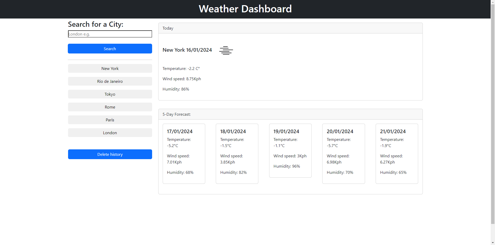

# Weather Dashboard

## Overview

The Weather Dashboard is a web application designed to provide users with real-time weather information and forecasts for their selected cities. This project aims to create a user-friendly interface that allows individuals to quickly access essential weather details about the weather.

## Features

1. **City Search:**
   - Users can search for a city to retrieve up-to-date weather information.

2. **Current Weather Display:**
   - The dashboard presents the current temperature, wind speed, and humidity for the selected city.

3. **Five-Day Forecast:**
   - A forecast for the next five days is provided, giving users a glimpse of the upcoming weather conditions.

4. **Search History:**
   - The application keeps track of the user's search history, making it easy to revisit and compare weather information for previously searched cities.

## How to Use

1. **Search:**
   - Type the name of a city in the search bar and press Enter or click the search button.

2. **View Weather Details:**
   - The current weather details and the five-day forecast for the selected city will be displayed.

3. **Search History:**
   - Click on the history buttons to quickly access weather information for previously searched cities.

## Technologies Used

- HTML
- CSS
- JavaScript
- [Weather API](https://openweathermap.org/) - API used for retrieving real-time weather data.

You Can see a live demo [here](https://danilorua.github.io/Weather-Dashboard)